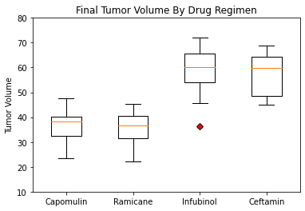

# Study on potential treatment for squamous cell carcinoma (SCC)

In this study, 249 mice identified with SCC tumour growth were treated through a variety of drug regimens. Over the course of 45 days, tumour development was observed and measured. 

## Aim

The purpose of this study was to compare the performance of Pymaceuticals' drug of interest, Capomulin, versus the other treatment regimens.

## Tools

Matplotlib, pandas, scipy, numpy

## Findings

1. Ramicane and Capomulin are the only two out of ten potential treatments that show positive results in treating SCC, consistently reducing volume of tumor from one time point to the next time point over the 45 days. 
2. Ramicane performs slightly better than Capomulin based on the mean (40.22 mm3 vs 40.68 mm3) and median (40.67 mm3 vs 41.56 mm3) of tumor volume over the study period and the mean (34.96 mm3 vs 36.24 mm3) of the tumor volume on the 45th day. 
3. There is a good consistency in the performance of Ramicane and Capomulin, based on relatively lower standard deviation, lower IQR, upper quartile less than 45 mm3 and no outliers identified for the tumor volume results.
4. There is a strong positive correlation (0.84) between weight and tumor volume. Based on this, the strength of the performance / effectiveness of Ramicane and Capomulin may have been overstated, as mice used for these two treatments on average are lighter than for other treatments, approx. 20 g on average for Ramicane and Capomulin vs over 27 g on average for all other treatments. 

## Boxplot

 

